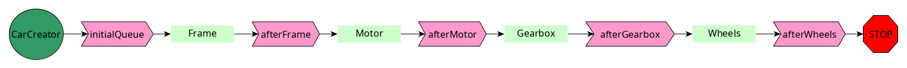
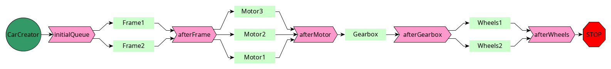

# Workflow
## Présentation
Le workflow présenté dans ce programme correspond grossièrement à la fabrication d'une voiture.
Une voiture a un chassis (Frame), un moteur (Moteur) , une Boite de vitesses (Gearbox) et des roues.
Chaque tâche a un nom, une queue d'entrée, une queue de sortie et une durée.
Les queues sont les ressources partagées, sur lesquelles le mot-clé `synchronized` doit être placé.

## SampleWorkflow
Dans ce programme, on considère qu'il n'y a qu'un poste de travail pour chaque tâche. Cela est illustré ci-dessous:

## ComplexWorkflow
Dans ce programme, on a 2 postes "chassis", 3 postes "moteur", 1poste "Boite de vitesses" et 2 postes "Roues".
